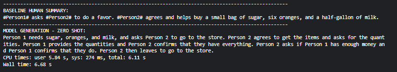
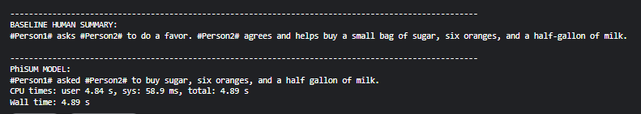

# PhiSUM :- Model Card for phi2 - dialogue-summarizer-peft

#### This model is a PEFT fine-tuned variant of the microsoft/phi-2 base model, trained to perform instruction-following dialogue summarization using lightweight adapter layers.

## Model Description

#### The model takes conversational input and outputs concise summaries using an instruction-tuned prompt format. It uses LoRA-based adapters for Parameter-Efficient Fine-Tuning (PEFT), enabling improved performance with significantly reduced training time and compute resources.

## This Model was inspired from
1. [Medium blog](https://dassum.medium.com/fine-tune-large-language-model-llm-on-a-custom-dataset-with-qlora-fb60abdeba07)
from Suman Das

2. [ Kaggle Notebook](https://www.kaggle.com/code/dassum/finetune-phi-2-on-custom-dataset?source=post_page-----fb60abdeba07---------------------------------------)

## DataSet Used
[DialogSum](https://huggingface.co/datasets/neil-code/dialogsum-test)

## Why Phi-2?

### I chose microsoft/phi-2 for this project because:

1. It has 2.7 billion parameters, striking a perfect balance between performance and compute efficiency.

2. It performs exceptionally well on reasoning and general language understanding tasks.

3. It’s publicly available and can be fine-tuned efficiently using LoRA or QLoRA

## Imports and Libraries
| **Library**      | **Version**     |
|------------------|-----------------|
| transformers     | 4.38.2          |
| peft             | 0.8.2           |
| trl              | 0.8.6           |
| datasets         | 2.19.0          |
| bitsandbytes     | 0.46.0          |
| accelerate       | 0.28.0          |
| torch            | 2.2.2+cu118     |

## Before Fine-Tuning

## After Fine-Tuning

## Base Model:

- Model Used: microsoft/phi-2

- Architecture: Causal Language Model (CausalLM)

- Size: 2.7 Billion Parameters

- Tokenizer: AutoTokenizer from Hugging Face (used offline)

- Precision: 8-bit (via bitsandbytes)

## Training Method:

- Type: Supervised Fine-Tuning using SFTTrainer from trl

- PEFT Method: LoRA

- LoRA Configuration:

  - r=64 (rank)

  - lora_alpha=32

  - lora_dropout=0.05

  - target_modules: ['q_proj', 'k_proj', 'v_proj', 'dense']

  - bias="none"

## Training Configuration:

- Frameworks: HuggingFace Transformers, Datasets, TRL, Accelerate

- Device: P100 GPU (Kaggle Notebook)

- Hyperparameters:

- max_steps=1000

- learning_rate=2e-4

- per_device_train_batch_size=4

- gradient_accumulation_steps=4

- warmup_steps=100

- gradient_checkpointing=True

- optim="paged_adamw_8bit"

- Eval Strategy: Every 25 steps (eval_steps=25)

- Save Strategy: Every 25 steps

- Logging: Every 25 steps

## Training Duration
- Total Time: ~4.5 hours on Kaggle P100 GPU

- Epochs: ~9 (calculated from step-to-epoch mapping)

- Steps: 1000

